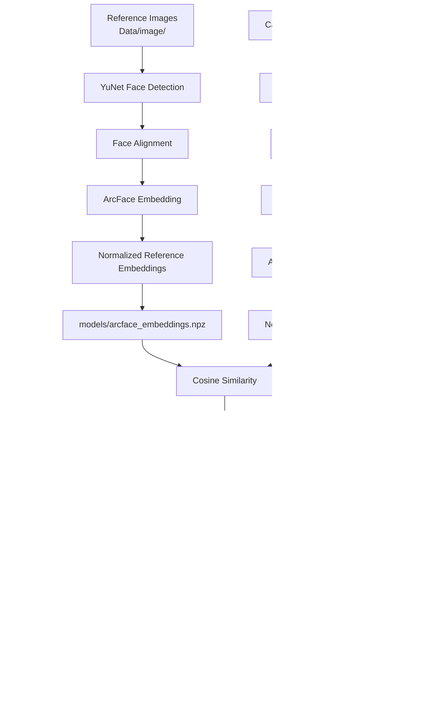
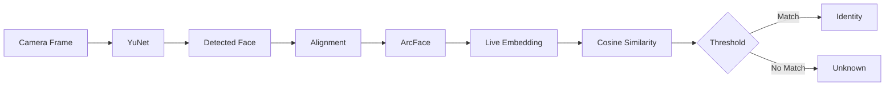
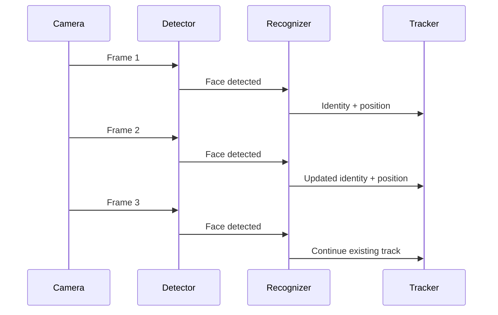
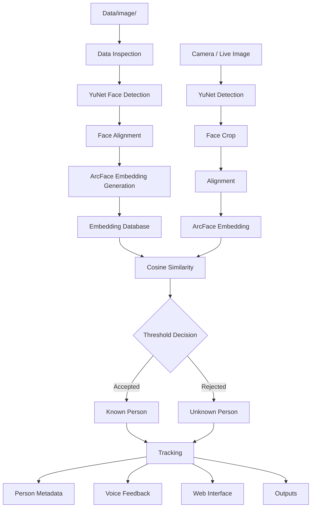

# Face Recognition System

> An end-to-end computer-vision project for face detection, face alignment, ArcFace embedding generation, cosine-similarity recognition, tracking, person metadata, voice feedback, and a web interface.

---

## Table of Contents

- [Project Overview](#project-overview)
- [What the System Does](#what-the-system-does)
- [System Architecture](#system-architecture)
- [Complete Recognition Pipeline](#complete-recognition-pipeline)
- [Project Structure](#project-structure)
- [Technology Stack](#technology-stack)
- [How Face Recognition Works](#how-face-recognition-works)
- [YuNet Face Detection](#yunet-face-detection)
- [Face Alignment](#face-alignment)
- [ArcFace Embeddings](#arcface-embeddings)
- [Cosine Similarity Matching](#cosine-similarity-matching)
- [Recognition Threshold](#recognition-threshold)
- [Face Tracking](#face-tracking)
- [Voice Feedback](#voice-feedback)
- [Web Application](#web-application)
- [Notebook Pipeline](#notebook-pipeline)
- [Data and Models](#data-and-models)
- [Person Details](#person-details)
- [Installation](#installation)
- [Running the Project](#running-the-project)
- [Testing](#testing)
- [End-to-End Workflow](#end-to-end-workflow)
- [Performance](#performance)
- [Troubleshooting](#troubleshooting)
- [Limitations](#limitations)
- [Future Improvements](#future-improvements)
- [Responsible Use](#responsible-use)

---

## Project Overview

**Face Recognition System** is a modular facial-recognition project built as a complete pipeline rather than a single script. It separates data preparation, face detection, alignment, embedding generation, recognition, application logic, and outputs.

The primary recognition pipeline is:

```text
Reference Images
      ↓
YuNet Face Detection
      ↓
Face Alignment
      ↓
ArcFace Embedding
      ↓
Reference Embedding Database
      ↓
Live Camera / Image
      ↓
YuNet Face Detection
      ↓
Face Alignment
      ↓
ArcFace Embedding
      ↓
Cosine Similarity
      ↓
Similarity Threshold
      ↓
Known / Unknown
      ↓
Face Tracking
      ↓
Person Details + Voice + Web Interface
```

The project is also designed as a learning and engineering workflow: each major stage is documented in a dedicated Jupyter notebook so that the system can be understood and debugged layer by layer.

---

## What the System Does

The system can:

1. Store reference face images in `Data/image/`.
2. Detect faces using YuNet.
3. Extract and prepare detected face regions.
4. Generate facial embeddings using ArcFace.
5. Store reference embeddings and labels in `models/arcface_embeddings.npz`.
6. Generate an embedding for a live face.
7. Compare the live embedding with stored embeddings using cosine similarity.
8. Select the highest-similarity candidate.
9. Apply a recognition threshold before accepting an identity.
10. Track recognized faces across camera frames.
11. Retrieve additional person information from `person_details.json`.
12. Provide optional text-to-speech feedback.
13. Present recognition results through the application interface.
14. Store generated artifacts in `outputs/`.

---

# System Architecture



---

# Complete Recognition Pipeline

## Offline / Reference Pipeline

Reference images are converted into numerical face representations before live recognition:


This avoids repeatedly processing every reference image during every camera frame.

## Online / Live Pipeline



---

# Project Structure

```text
FaceRecognitionSystem/
│
├── .env
├── .gitignore
├── README.md
├── requirements.txt
│
├── Data/
│   └── image/
│
├── models/
│   ├── face_detection_yunet_2023mar.onnx
│   └── arcface_embeddings.npz
│
├── outputs/
│
├── face_recognition_complete/
│   ├── static/
│   ├── templates/
│   ├── app.py
│   ├── person_details.json
│   ├── README.md
│   └── requirements.txt
│
├── 01_data_inspection.ipynb
├── 02_yunet_face_detection.ipynb
├── 03_face_alignment.ipynb
├── 04_arcface_embeddings.ipynb
├── 05_Face_Recognition.ipynb
│
├── main.py
│
└── test_project.py
```

### Directory Responsibilities

| Path | Purpose |
|---|---|
| `.env` | Local environment and runtime configuration |
| `.gitignore` | Git exclusion rules |
| `README.md` | Main project documentation |
| `requirements.txt` | Root Python dependencies |
| `Data/image/` | Reference face images |
| `models/` | Detection model and recognition embedding database |
| `outputs/` | Generated results, logs, visualizations, or artifacts |
| `face_recognition_complete/` | Integrated application/interface |
| `static/` | Web static assets |
| `templates/` | Web templates |
| `person_details.json` | Person-specific metadata |
| `01_data_inspection.ipynb` | Dataset inspection |
| `02_yunet_face_detection.ipynb` | YuNet detection |
| `03_face_alignment.ipynb` | Face alignment |
| `04_arcface_embeddings.ipynb` | ArcFace embedding generation |
| `05_Face_Recognition.ipynb` | End-to-end recognition |
| `main.py` | Main project entry point |
| `test_project.py` | Project validation/testing |

---

# Technology Stack

| Technology | Role |
|---|---|
| Python | Core programming language |
| OpenCV | Camera capture and image processing |
| YuNet | Face detection |
| ArcFace | Face embedding / recognition representation |
| InsightFace | Face-analysis and recognition components |
| NumPy | Numerical computation and embeddings |
| JSON | Person metadata |
| Jupyter Notebook | Development and experimentation |
| HTML/CSS/JavaScript | Web-interface layer |
| Pyttsx3 | Local text-to-speech feedback |

---

# How Face Recognition Works

A face-recognition system does not need to compare two photographs pixel-by-pixel. Instead, the face is transformed into an **embedding**: a numerical representation suitable for comparison.

```text
Face Image
    ↓
Face Detection
    ↓
Face Alignment
    ↓
ArcFace
    ↓
Face Embedding
    ↓
Numerical Vector
```

Reference embeddings are stored and compared with embeddings generated from live faces.

---

# YuNet Face Detection

YuNet is responsible for locating faces in an image or camera frame.

```text
Input Frame
┌──────────────────────────────┐
│                              │
│       ┌─────────────┐        │
│       │    FACE     │        │
│       │             │        │
│       └─────────────┘        │
│                              │
└──────────────────────────────┘
              ↓
        Face Bounding Box
```

The expected model is:

```text
models/face_detection_yunet_2023mar.onnx
```

The detector supplies the face location used by the subsequent recognition stages.

---

# Face Alignment

After detection, the face region is extracted and prepared for recognition.

```text
Detected Face
     ↓
Crop / Alignment
     ↓
Recognition-Ready Face
```

Alignment reduces variation caused by position, scale, orientation, and camera framing, making the recognition input more consistent.

---

# ArcFace Embeddings

ArcFace transforms a prepared face into a numerical embedding:

```text
Face
  ↓
ArcFace
  ↓
[0.12, -0.04, 0.83, ..., 0.17]
```

The vector is not intended to be human-readable. It represents facial characteristics in an embedding space where similarity can be calculated.

The project uses the ArcFace recognition component through the InsightFace ecosystem.

---

# Cosine Similarity Matching

For a live embedding `q` and stored embedding `e`, cosine similarity is:

```text
cosine_similarity(q, e)
= (q · e) / (||q|| × ||e||)
```

The recognition pipeline normalizes embeddings before comparison. For normalized vectors, the similarity calculation is equivalent to their dot product.

Example:

```text
Live Face
    ↓
Live Embedding
    ↓
Compare with stored embeddings
    ├── Person A → 0.31
    ├── Person B → 0.78
    ├── Person C → 0.42
    └── Person D → 0.25
                 ↓
            Highest = 0.78
                 ↓
             Person B
```

The highest score is then evaluated against the recognition threshold.

---

# Recognition Threshold

The threshold controls whether the best candidate is accepted as a known identity.

```text
Similarity
    │
    │             ACCEPT
    │        ─────────────────
    │              ↑
    │          Threshold
    │              ↓
    │        ─────────────────
    │             UNKNOWN
    └────────────────────────────
```

Conceptually:

```python
if best_similarity >= threshold:
    identity = best_match
else:
    identity = "Unknown"
```

A lower threshold may accept more matches while increasing false matches. A higher threshold is stricter but can increase false rejections. Threshold selection should therefore be calibrated using representative validation data.

---

# Face Tracking

A camera produces many consecutive frames. Without tracking, the same person could be treated as a new detection repeatedly.

The recognition pipeline therefore maintains tracking state such as:

- track ID
- bounding box
- face center
- identity
- last-seen time
- last voice-feedback time



Tracking provides continuity between recognition events and helps control repeated notifications.

---

# Voice Feedback

The system can provide local text-to-speech feedback after recognition.

```text
Face Detected
     ↓
Identity Recognized
     ↓
Recognition Event
     ↓
Text-to-Speech
```

A repeat interval can be used so that a continuously visible person is not announced on every camera frame.

---

# Web Application

The integrated application is located in:

```text
face_recognition_complete/
```

Its structure is:

```text
face_recognition_complete/
├── static/
├── templates/
├── app.py
├── person_details.json
├── README.md
└── requirements.txt
```

The application connects the recognition result with human-readable person information.

Conceptually:

```text
Recognition Result
       │
       ├── Identity
       └── Similarity / Recognition State
                 │
                 ▼
        person_details.json
                 │
                 ▼
          Person Information
                 │
                 ▼
             Web Interface
```

The actual fields displayed depend on the current `person_details.json` content.

---

# Notebook Pipeline

## `01_data_inspection.ipynb`

Used for inspecting and understanding the reference data, image organization, and dataset quality.

```text
Dataset → Inspect Files → Inspect Images → Validate Data
```

## `02_yunet_face_detection.ipynb`

Documents the YuNet face-detection stage, including detection and bounding-box visualization.

```text
Image → YuNet → Face Bounding Box → Visualization
```

## `03_face_alignment.ipynb`

Documents preparation of detected faces for recognition.

```text
Detected Face → Crop / Alignment → Recognition-Ready Face
```

## `04_arcface_embeddings.ipynb`

Documents generation and preparation of ArcFace embeddings.

```text
Aligned Face → ArcFace → Embedding → Normalization → Stored Embedding
```

## `05_Face_Recognition.ipynb`

Combines detection, embedding, similarity calculation, thresholding, and identity recognition.

```text
Camera/Image
    ↓
YuNet
    ↓
Face Crop
    ↓
ArcFace
    ↓
Embedding
    ↓
Cosine Similarity
    ↓
Threshold
    ↓
Known / Unknown
```

---

# Data and Models

The project intentionally separates reference data from model artifacts:

```text
Data/
└── image/

models/
├── face_detection_yunet_2023mar.onnx
└── arcface_embeddings.npz
```

This keeps raw/reference images separate from generated recognition artifacts.

## Reference Images

Place the images used to build the reference database under:

```text
Data/image/
```

## YuNet Model

Expected location:

```text
models/face_detection_yunet_2023mar.onnx
```

## ArcFace Embedding Database

Expected location:

```text
models/arcface_embeddings.npz
```

The recognition implementation expects the embedding database to contain the relevant embedding and identity-label arrays, including:

```text
embeddings
labels
```

The number of identities and reference images depends on the current dataset and embedding-generation process.

---

# Person Details

Person-specific application information is stored separately from the face embeddings:

```text
face_recognition_complete/person_details.json
```

This separation allows the recognition model to return an identity while the application retrieves additional attributes using that identity as the key.

```text
Face Recognition
      ↓
Identity / Label
      ↓
person_details.json
      ↓
Human-readable profile information
```

This avoids coupling every descriptive person attribute to the numerical embedding database.

---

# Outputs

Generated files should be kept under:

```text
outputs/
```

Depending on the workflow, this directory can contain processed images, recognition results, logs, visualizations, evaluation artifacts, or other generated files.

Keeping generated material outside the source-code directories makes the repository easier to maintain.

---

# Installation

## 1. Create a Virtual Environment

Windows:

```powershell
python -m venv .venv
.venv\Scripts\activate
```

Linux/macOS:

```bash
python3 -m venv .venv
source .venv/bin/activate
```

## 2. Install Dependencies

```bash
pip install -r requirements.txt
```

If the integrated application has additional dependencies, also follow:

```text
face_recognition_complete/README.md
```

and its local `requirements.txt`.

---

# Running the Project

The root project entry point is:

```text
main.py
```

Run it with:

```bash
python main.py
```

For the web application, use the startup instructions documented in:

```text
face_recognition_complete/README.md
```

Web frameworks should be launched using their appropriate framework command rather than assuming that `python app.py` is always correct.

---

# Testing

The project contains:

```text
test_project.py
```

Run:

```bash
python test_project.py
```

Useful validation checks include:

```text
Project Files
     ↓
Model Availability
     ↓
Embedding Database
     ↓
Recognition Components
     ↓
Application Components
```

---

# Configuration

The root contains:

```text
.env
```

Use this file for local, environment-specific configuration where the application expects environment variables. Do not place secrets directly in source code.

The `.env` file should normally be excluded from version control through `.gitignore`.

The exact environment-variable names should match those actually consumed by the application; they should not be invented independently of the code.

---

# End-to-End Workflow



---

# Recognition Decision Logic

Let:

```text
q  = live face embedding
eᵢ = stored embedding for identity i
```

For each stored identity:

```text
similarityᵢ = cosine_similarity(q, eᵢ)
```

The candidate with the largest similarity is selected:

```text
best_identity = argmax(similarityᵢ)
```

Then the threshold determines the final decision:

```text
if best_similarity >= threshold:
    return best_identity
else:
    return Unknown
```

The important point is that **highest similarity and accepted identity are two separate decisions**. The most similar known person should not automatically be treated as a valid match when the similarity is below the acceptance threshold.

---

# Performance Considerations

A real-time pipeline contains several computational stages:

```text
Camera Capture
      ↓
Face Detection
      ↓
Face Cropping
      ↓
Embedding Generation
      ↓
Similarity Search
      ↓
Tracking
      ↓
Visualization
```

Runtime cost can increase with camera resolution, number of faces, number of stored embeddings, model size, and available CPU/GPU resources.

Useful optimization principles include:

- precompute reference embeddings
- avoid unnecessary repeated recognition
- use tracking between recognition events where appropriate
- keep camera resolution appropriate for the application
- normalize embeddings before similarity comparison
- use hardware acceleration when the deployment environment and model runtime support it

---

# Troubleshooting

## Camera Does Not Open

Check:

1. The camera is connected.
2. No other program is using it.
3. The correct camera index is configured.
4. The operating system has granted camera access.
5. The application is running on the machine that owns the camera.

## YuNet Model Not Found

Verify:

```text
models/face_detection_yunet_2023mar.onnx
```

exists and that the path used by the code matches the project structure.

## Embedding Database Not Found

Verify:

```text
models/arcface_embeddings.npz
```

exists and contains the expected embedding/label arrays.

## Too Many Unknown Results

Possible causes:

- threshold too high
- poor reference-image quality
- lighting differences
- pose differences
- inconsistent alignment
- insufficient reference images
- poor camera quality

Evaluate the data and similarity distribution before changing the threshold blindly.

## Incorrect Identity

Possible causes include:

- threshold too low
- visually similar reference faces
- insufficient reference images
- poor lighting
- extreme pose
- partial occlusion
- motion blur

Recognition should be evaluated with representative validation data rather than relying on a single example.

## Web Application Does Not Start

Check:

```text
face_recognition_complete/README.md
```

and verify its dependencies. Use the startup command required by the application's framework.

---

# Limitations

Recognition performance can be affected by:

- lighting
- camera quality
- face angle
- occlusion
- motion blur
- image resolution
- changes in appearance
- reference-image quality
- reference-dataset size and diversity
- similarity-threshold selection

A similarity score is a model output, not absolute proof of identity.

For high-assurance identity verification, additional authentication mechanisms and formal evaluation procedures should be considered.

---

# Future Improvements

## Better Multi-Face Tracking

Introduce a dedicated multi-object tracking algorithm to improve identity continuity and reduce repeated recognition.

## Recognition Evaluation

Add a formal evaluation pipeline containing:

- genuine pairs
- impostor pairs
- similarity distributions
- false-acceptance analysis
- false-rejection analysis
- precision/recall
- confusion analysis

## Scalable Vector Search

For a larger identity database:

```text
Live Embedding
      ↓
Vector Search
      ↓
Top-K Candidates
      ↓
Threshold
      ↓
Identity
```

## GPU Acceleration

Use supported GPU inference where the deployment environment provides a compatible runtime.

## Advanced Dashboard

Possible interface additions include:

- live recognition status
- similarity visualization
- recognition history
- timestamps
- track IDs
- person profile cards
- session statistics
- FPS monitoring
- event logs
- analytics charts

## Database-backed Profiles

The JSON metadata layer can later be replaced or supplemented with a database for larger deployments and multi-user applications.

---

# Responsible Use

Face recognition processes biometric information and should be deployed carefully.

For real-world use:

- obtain appropriate consent where required
- comply with applicable privacy and data-protection requirements
- protect stored embeddings and person metadata
- restrict access to biometric information
- avoid unnecessary exposure of personal details
- define retention and deletion policies
- evaluate accuracy on the intended population
- provide an appropriate fallback when recognition is uncertain
- do not treat an automated recognition result as infallible evidence of identity

---

# Development and Debugging Strategy

The modular project layout makes failures easier to isolate:

```text
                    Face Recognition System
                              │
             ┌────────────────┴────────────────┐
             │                                 │
        OFFLINE PIPELINE                  LIVE PIPELINE
             │                                 │
      Reference Images                       Camera
             │                                 │
      Face Detection                    Face Detection
             │                                 │
      Face Alignment                    Face Alignment
             │                                 │
     ArcFace Embedding                ArcFace Embedding
             │                                 │
     Stored Embeddings                Live Embedding
             │                                 │
             └──────────────┬──────────────────┘
                            │
                    Cosine Similarity
                            │
                    Threshold Decision
                            │
                    Known / Unknown
                            │
                         Tracking
                            │
              ┌─────────────┼─────────────┐
              │             │             │
              ▼             ▼             ▼
        Person Details     Voice        Web UI
                            │
                            ▼
                         Outputs
```

This provides a practical debugging strategy:

```text
No face detected
    → investigate YuNet

Face detected but embedding fails
    → investigate face preparation / ArcFace

Embedding works but identity is wrong
    → investigate reference embeddings / threshold / data quality

Identity works but information is wrong
    → investigate person_details.json

Identity works but UI is wrong
    → investigate application layer

Recognition repeats unexpectedly
    → investigate tracking and repeat-control logic
```

---

# Quick Start

```bash
# Create environment
python -m venv .venv

# Windows activation
.venv\Scripts\activate

# Install dependencies
pip install -r requirements.txt

# Run project tests
python test_project.py

# Start the main application
python main.py
```

For the integrated web interface, follow the instructions in:

```text
face_recognition_complete/README.md
```

---

# Final Project Structure

```text
FaceRecognitionSystem/
│
├── .env
├── .gitignore
├── README.md
├── requirements.txt
│
├── Data/
│   └── image/
│
├── models/
│   ├── face_detection_yunet_2023mar.onnx
│   └── arcface_embeddings.npz
│
├── outputs/
│
├── face_recognition_complete/
│   ├── static/
│   ├── templates/
│   ├── app.py
│   ├── person_details.json
│   ├── README.md
│   └── requirements.txt
│
├── 01_data_inspection.ipynb
├── 02_yunet_face_detection.ipynb
├── 03_face_alignment.ipynb
├── 04_arcface_embeddings.ipynb
├── 05_Face_Recognition.ipynb
│
├── main.py
│
└── test_project.py
```

---

# Project Summary

The project combines the major stages of a modern face-recognition workflow:

```text
YuNet
  +
Face Alignment
  +
ArcFace
  +
Cosine Similarity
  +
Threshold Decision
  +
Face Tracking
  +
Person Metadata
  +
Voice Feedback
  +
Web Interface
```

The repository is organized so that **data, models, experiments, application code, configuration, and generated outputs remain separate**. The notebooks document the progression from data inspection through complete recognition, while the application directory provides the integrated interface layer.

---

## Project Identity

**Project:** Face Recognition System  
**Domain:** Computer Vision / Artificial Intelligence / Face Recognition  
**Primary Pipeline:** YuNet + ArcFace + Cosine Similarity + Tracking + Person Metadata + Web Interface
